# Order Management System

A modern and intuitive **Order Management System** designed to streamline operations for garment manufacturing businesses. This system allows seamless management of orders, garments, materials, machines, and users with role-based access control.

---

## Table of Contents

1. [Features](#features)
2. [Tech Stack](#tech-stack)
3. [Prerequisites](#prerequisites)
4. [Steps](#steps)

---

## Features

### **Dashboard**

-   Overview of system activity, including order stats, user activity, and machine status.

    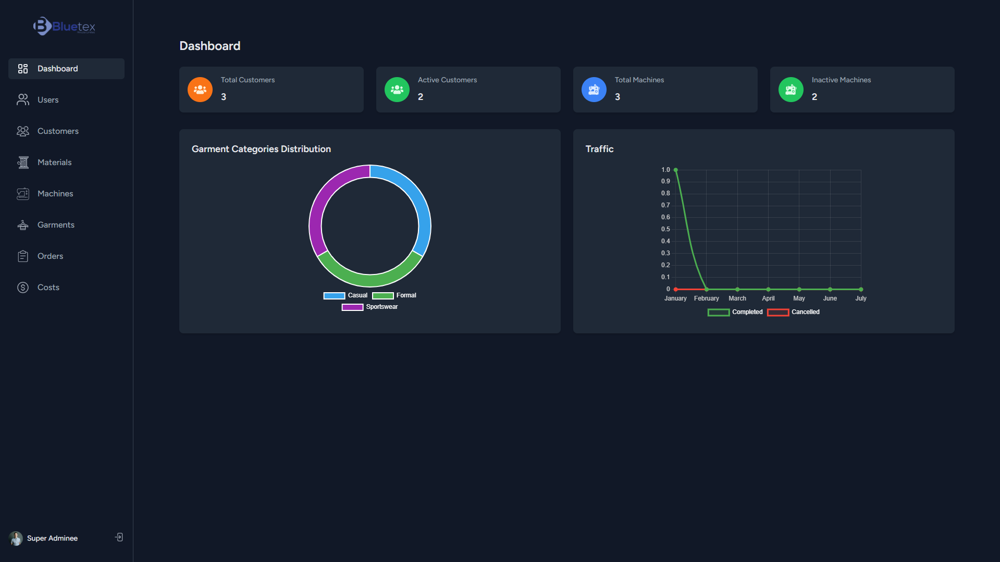

### **Login**

-   The login page allows authorized users to securely access the Order Management System.

    

### **Forgot Password**

-   The forgot password functionality allows users to securely reset their password via email if they forget their login credentials.

    

### **User Management**

-   Role-based access control with predefined roles:
    -   **Super Admin**, **Manager**, **Inventory Manager**, **Garment Manager**, **Staff**.
-   Manage users, assign roles, and maintain user details.
-   Display active/inactive users with real-time statistics.

-   The users table provides a comprehensive view of all registered users, including their roles and management options.

    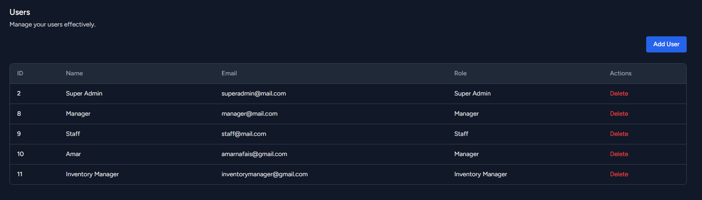

-   The register user form allows administrators to add new users by providing their details and assigning roles.

    

-   Allows users to update their personal information, including name, and email through a user-friendly interface.

    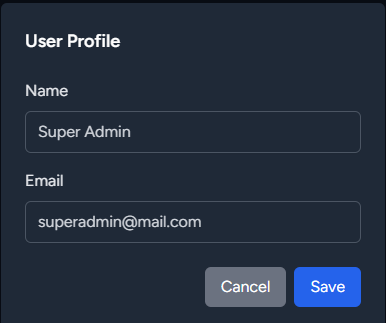

### **Customer Management**

-   Create, update, and delete customer records.
-   Maintain detailed customer profiles, including contact information and address.
-   Enable or disable customer accounts with status toggles.
-   Real-time updates to customer lists, ensuring up-to-date records.
-   Seamless integration with orders for streamlined management.

-   Displays a comprehensive list of customers, including their details such as name, email, phone, address, and account status.

    

-   Provides a user-friendly form to quickly add new customer details, including name, email, phone, and address.

    

-   Enables seamless editing of existing customer information, allowing updates to their details without leaving the page.

    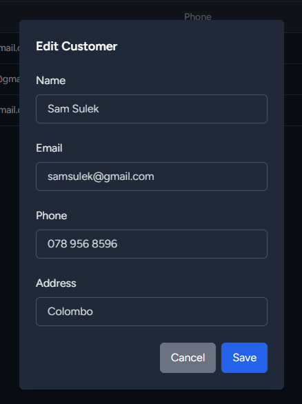

### **Material Management**

-   Track and manage material stock levels.
-   Auto-update material quantities when orders are placed.

-   Displays a comprehensive list of all materials, including their names, unit costs, available stock, and measurement units for easy inventory management.

    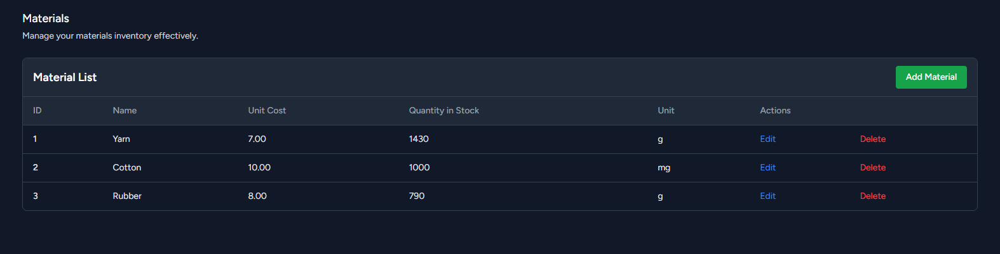

-   Allows users to add new materials to the inventory with details such as name, unit cost, available quantity, and unit type.

    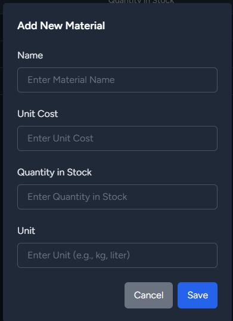

-   Facilitates updates to material details, ensuring inventory information remains accurate and up-to-date.

    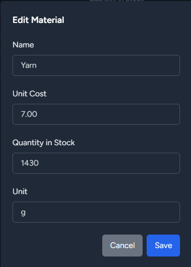

### **Machine Management**

-   Dynamic machine status updates based on orders.
-   Assign machines to garments and orders seamlessly.

-   Displays a detailed list of all machines, including their names, types, hourly rates, and current operational statuses for streamlined management.

    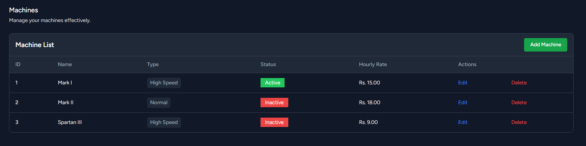

-   Enables users to add new machines by providing details such as machine name, type, and hourly rate.

    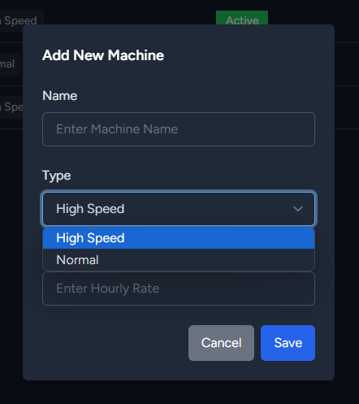

-   Allows users to update machine information, ensuring that operational and cost details remain accurate.

    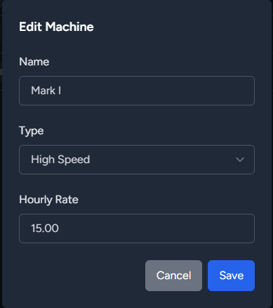

### **Garment Management**

-   Assign materials and machines to garments.
-   View and manage garment details comprehensively.

-   Displays a comprehensive list of garments, including their names, categories, and associated details for efficient management.

    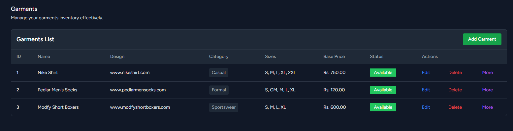

-   Provides an interface for adding new garments by specifying garment name, category, and other relevant attributes.

    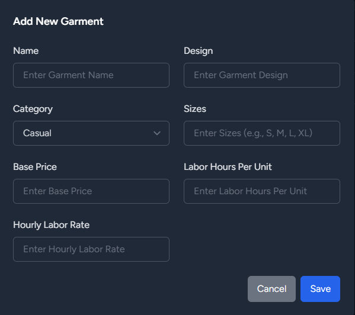

-   Allows users to modify existing garment details, ensuring accurate and up-to-date garment information in the system.

    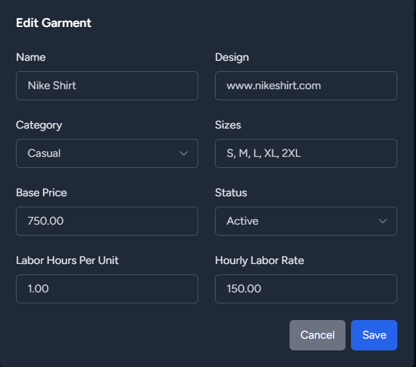

-   Displays detailed information about a selected garment, including associated machines and materials, for effective garment management.

    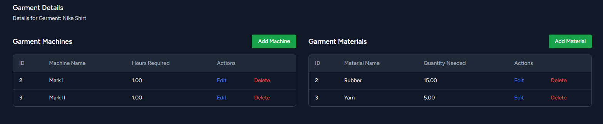

-   Lists all machines assigned to the garment along with their required hours and statuses.

    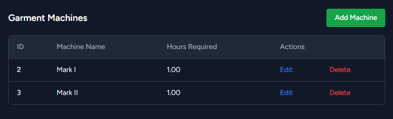

-   Enables assigning machines to a garment by selecting available machines and specifying required hours.

    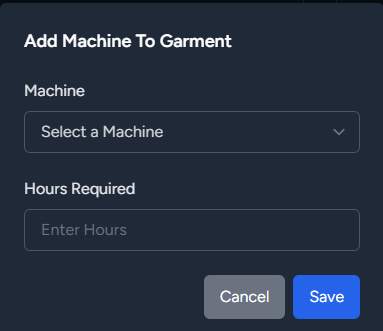

-   Allows updating machine assignments for a garment, including changing required hours or reassigning machines.

    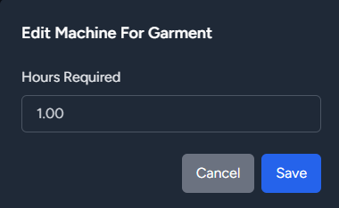

-   Lists all materials associated with the garment, including quantities needed and stock adjustments.

    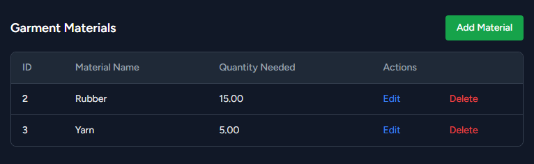

-   Provides a form to associate new materials with a garment, specifying the quantities needed.

    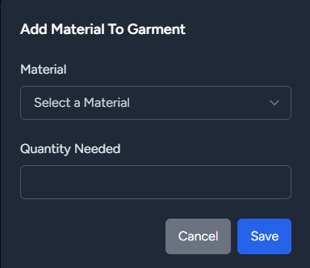

-   Enables updating material associations for a garment, including adjusting quantities or changing materials.

    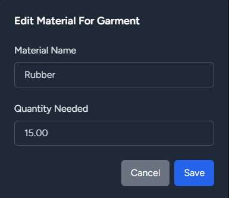

### **Order Management**

-   Create, update, and delete orders.
-   Automatically update machine statuses based on order progress.
-   Material stock adjustments tied to order quantities.
-   Real-time updates to order statuses (e.g., Pending, In Progress, Completed, Cancelled).

-   Displays a list of all orders, including customer names, garments ordered, quantities, sizes, statuses, and due dates for streamlined management.

    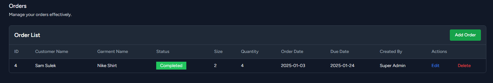

-   Allows creating a new order by selecting a customer, garment, size, quantity, and due date. Automatically adjusts machine statuses and material stocks as required.

    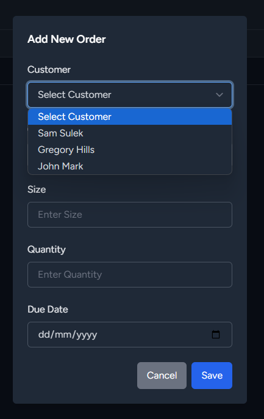

-   Enables modifying existing orders, including updating order details or changing the status.

    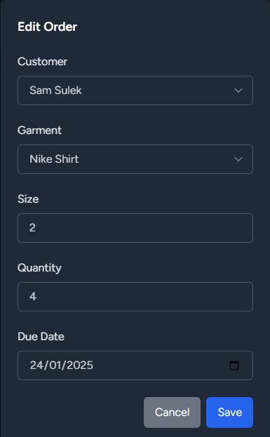

### **Cost Management**

-   Automatically calculate production costs for each order, including material and machine usage.
-   Track and manage overall costs associated with garments and orders.
-   Generate reports to analyze cost trends over time.
-   Visual breakdown of costs for materials and machine hours per order.

-   Displays a detailed breakdown of costs, including material expenses, machine hours, and total production costs for each order.

    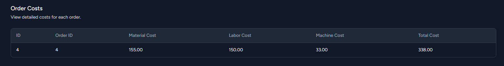

### **Email Notifications**

-   Notify users of critical updates using SMTP email integration (Gmail).

    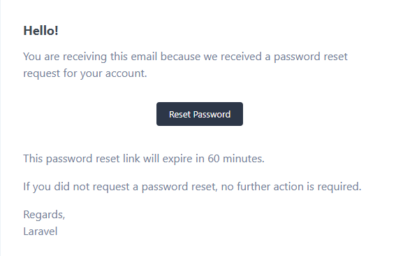

---

## Tech Stack

-   **Framework**: Laravel 10.x
-   **Frontend**: Tailwind CSS
-   **Database**: MySQL
-   **Charting**: Chart.js
-   **Authentication**: Laravel Breeze with role-based access control
-   **Deployment**: Docker-ready configuration

---

### Prerequisites

-   PHP >= 8.0
-   Composer
-   Node.js & npm
-   MySQL or any compatible database

### Steps

1. **Clone the repository**:
    ```bash
    git clone https://github.com/yourusername/order-management-system.git
    cd order-management-system
    ```
